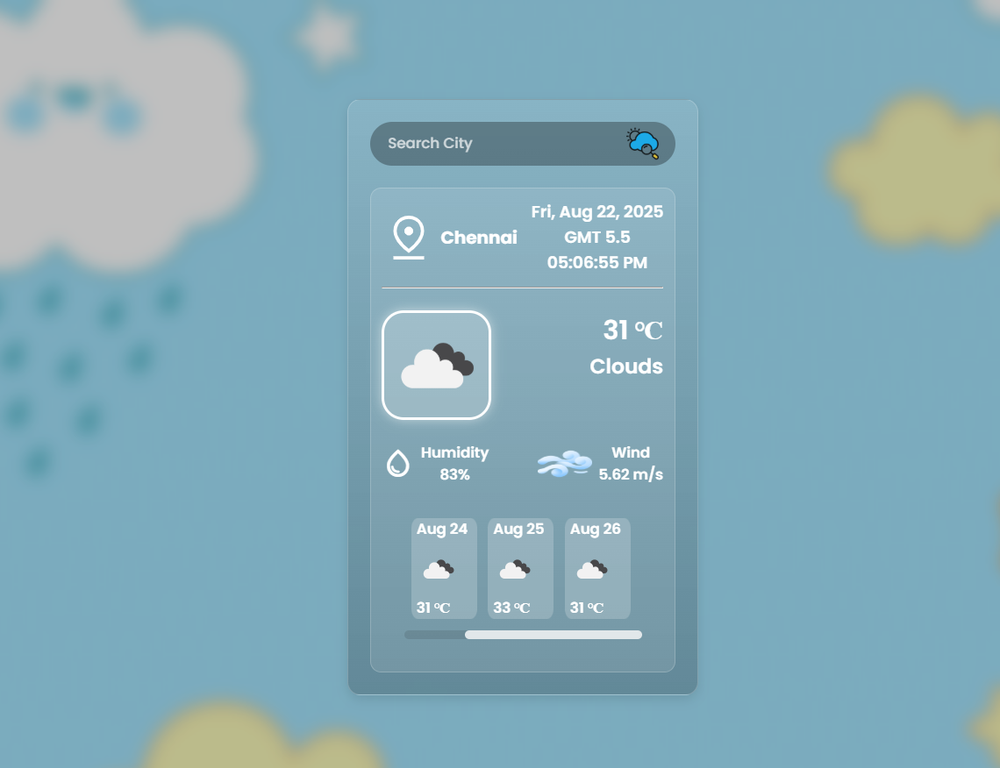

# 🌦️ SkyCast

A simple and interactive **Weather Application** built with **HTML, CSS, and JavaScript**.  
It fetches live weather data from the [OpenWeatherMap API](https://openweathermap.org/) and shows current weather, forecast, and local time for any city.

---
## 🌦️ App Preview

[](https://arpankhare-63.github.io/Weather-App/)

---

## ✨ Features
- 🔍 Search weather by **city name**
- 🌍 Shows **local date & time** based on city’s timezone
- 🌡️ Displays **temperature, humidity, wind speed, and condition**
- ⛅ Dynamic **weather icons** that change with conditions
- 📅 5-day **weather forecast**
- 📱 **Responsive design** (works on desktop & mobile)

---

## 🛠️ Tech Stack
- **HTML5** – Structure  
- **CSS3** – Styling  
- **JavaScript (ES6)** – Logic & API calls  
- **OpenWeatherMap API** – Weather data source  

---

## 🚀 Getting Started

### 1. Clone the repository
```bash
git clone https://github.com/YOUR-USERNAME/skycast.git
cd skycast
